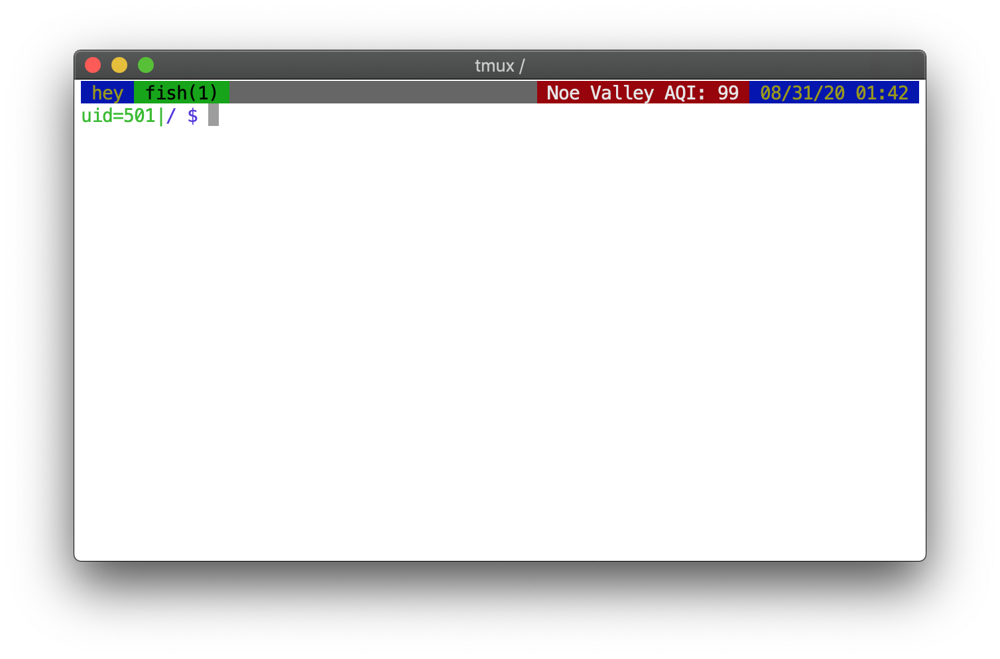

aqi indicator for for tmux. powered by the [iqair api](https://www.iqair.com/us/air-pollution-data-api)
> you could just `curl -s "http://api.airvisual.com/v2/nearest_city?key=$IQAIR_API_KEY" | jq ".data | { location: .city, aqi: .current.pollution.aqius }"`

### usage
```
$ go get -v -u github.com/cqsd/tmux-aqi
$ mkdir -p ~/.tmux-aqi
$ echo '132cb485...' > ~/.tmux-aqi/key
$ tmux-aqi
#[fg=brightwhite,bg=red] Noe Valley AQI: 99
```

set it (for example) in `status-right`
```
set -g status-right "#(tmux-aqi) %D %H:%M "
```



the most recent run is cached for 5 minutes in `~/.tmux-aqi/lastrun.json` to
respect rate limit (and also because aqi doesn't update very often. in fact it
could wait longer...). it's hardcoded for geoip fyi

### custom colors
you can set custom fg/bg colors for each air quality level by creating a
`~/.tmux-aqi/config.json` like so (all keys optional):

```json
{
    "good": {
        "fg": "black",
        "bg": "green"
    },
    "moderate": {
        "fg": "brightwhite",
        "bg": "magenta"
    },
    "unhealthy": {
        "fg": "#000000",
        "bg": "green"
    },
    "hazardous": {
        "fg": "#ffffff",
        "bg": "#000000"
    }
}
```

fyi these levels are not the same as the EPA's (they're much more conservative
wrt your health lol)

|US AQI range|level of health concern according to this code|
|-|-|
|<= 50|good|
|51 to 100|moderate|
|101 to 150|unhealthy|
|>= 151|hazardous|
